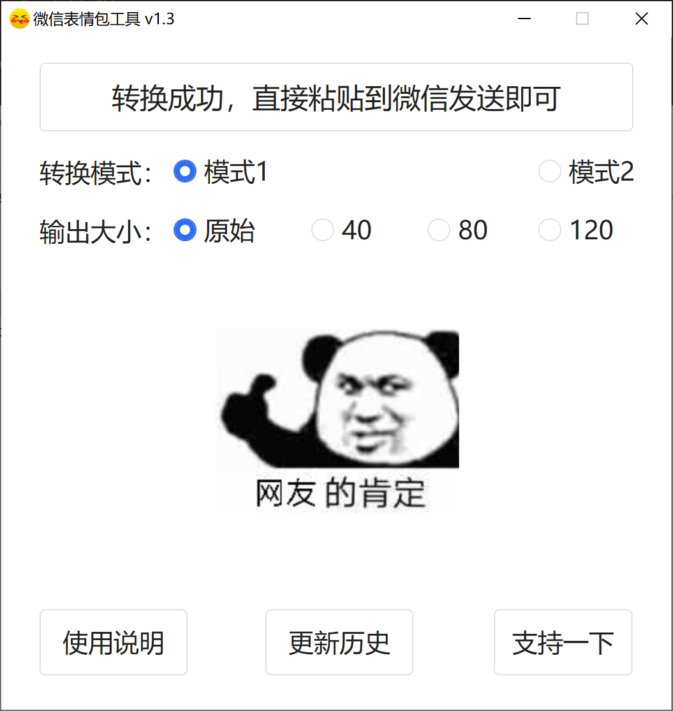
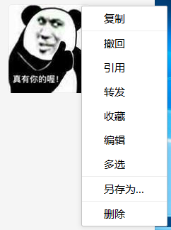
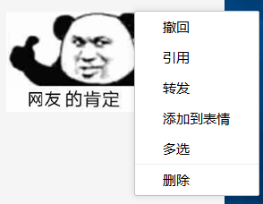

<h1 align="center">微信表情包工具</h1>
<h3 align="center">
	
快速将QQ或其他表情包转换成微信可添加的表情

	
</h3>

## 举个栗子

### 普通图片

### 转换为表情包

## 支持图片格式

`png` `jpg` `bmp` `gif` `webp`

## 图片大小限制
无（不建议超过`1024` x `1024`）

## 特别注意说明
受表情包格式的限制，原图片色彩越多越丰富，转换出来的表情包失真则会越严重（半透明图片也一样），可以尝试切换不同转换模式得到效果最佳的一个表情包使用。如果图片过大，内容可能会看不清，微信上表情包最大显示大小为`200` x `200`（强制性）。
