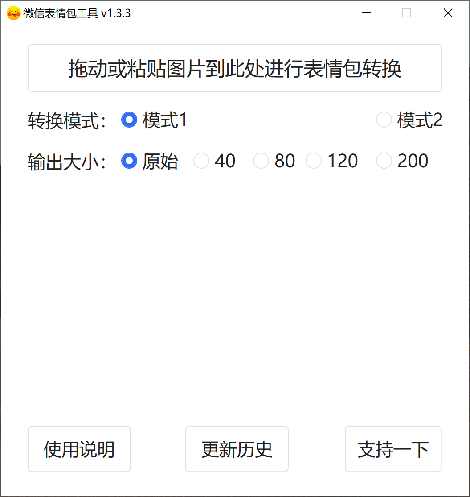

<h1 align="center">微信表情包工具</h1>
<h3 align="center">
	
快速将QQ或其他表情包转换成微信可添加的表情

	
</h3>

## 举个栗子

### 普通图片

### 转换为表情包

## 支持图片格式

`png` `jpg` `bmp`

不支持大图以及透明图，微信原生支持`gif`动图直接添加为表情，所以不需要转换。

## 代码引用

[NGif, Animated GIF Encoder for .NET](https://www.codeproject.com/Articles/11505/NGif-Animated-GIF-Encoder-for-NET)
